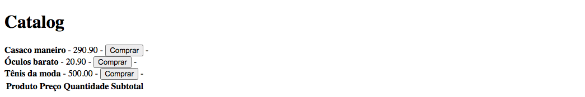

# ContextAPI - ReactJS

This is a [rocketseat](https://www.rocketseat.com.br/) learning bonus to understand how works the ContextAPI in ReactJS. This challenge help you improve your coding skills by building realistic application.

## Table of contents

- [Overview](#overview)
  - [The challenge](#the-challenge)
  - [Screenshot](#screenshot)
  - [Links](#links)
- [My process](#my-process)
  - [Built with](#built-with)
  - [What I learned](#what-i-learned)
  - [Useful resources](#useful-resources)
- [Author](#author)

## Overview

### The challenge

Users should be able to:

- Understand how ContextAPI works

### Screenshot



### Links

- Solution URL: [Github](https://github.com/gugavillar/studing_contextAPI)

## My process

To create this application, i used the base to create a react app with the [create-react-app](https://create-react-app.dev/) with TypeScript template

### Built with

- ReactJS
- Typescript
- [ContextAPI](https://pt-br.reactjs.org/docs/context.html)

### What I learned

In this project i was learn how the context API works, how to use Providers, Create Context and how to use this context in all components in the application, is a very useful to make any applications

```js
export const CartContext = createContext({} as CartContextData);

export function CartProvider({ children }: CartProviderProps) {
  const [items, setItems] = useState<ICartItem[]>([]);
  const [failedStockItems, setFailedStockItems] = useState<Number[]>([]);

  async function addProductToCart(product: Product) {
    const updateCart = [...items];
    const productIndexCart = updateCart.findIndex(item => item.product.id === product.id);
    const currentQuantity = items.find(item => item.product.id === product.id)?.quantity ?? 0;
    const isStockAvailable: StockResponse = await api.get(`stock/${product.id}`).then(response => response.data);

    if (isStockAvailable.quantity > currentQuantity) {
      if (productIndexCart >= 0) {
        updateCart[productIndexCart].quantity++;
      } else {
        updateCart.push({
          product, quantity: 1
        });
      }
      setItems(updateCart);
    } else {
      const updateFailedStockItems = [...failedStockItems];
      updateFailedStockItems.push(product.id);
      setFailedStockItems(updateFailedStockItems);
    }
  }
}
```

### Useful resources

- [ContextAPI](https://pt-br.reactjs.org/docs/context.html) - This helped me for understand how context works.

## Author

- Twitter - [@gugacocao](https://twitter.com/gugacocao)
- Linkedin - [gugavillar](https://www.linkedin.com/in/gugavillar/)
